# SWIFT CBPR+ Investigations — Database Schema for MS SQL Server 2019

## 1. Task

Receive SWIFT MX **CBPR+** messages following the **SwiftCase‑Investigations‑SR2026**
collection and persist them in a Microsoft SQL Server 2019 database so they can be
queried, audited and linked to the underlying payment transactions.

Two base messages are in scope:

| Message | Base message | Direction | Purpose |
|---------|--------------|-----------|---------|
| `camt.110.001.01` | InvestigationRequest | Requestor → Case Manager → Responder | Create / act on an investigation |
| `camt.111.001.02` | InvestigationResponse | Responder → Case Manager → Requestor | Respond to / update an investigation |

Each message is delivered with six **Usage Guidelines (UGs)** that restrict the
content for a business scenario:

| UG | Business meaning |
|----|------------------|
| `CCNR_CONR` | Creditor claims non‑receipt of payment / cover |
| `OTHR` | Other investigation type |
| `RQFI_COMP` | Request for information — compliance |
| `RQFI_SANC` | Request for information — sanctions |
| `RQFI_UTEX` | Request for information — unable to apply |
| `UTAP` | Unable to apply (booked statement entry) |

A `plain` and an `enriched` XSD variant exist per UG; the **plain** variants are
the authoritative structural source used here.

## 2. Source XSD inventory

```
swift/
├─ camt.110/                 # InvestigationRequest (camt.110.001.01)
│  ├─ plain/    (6 UG XSDs)
│  └─ enriched/ (6 UG XSDs)
└─ camt.111/                 # InvestigationResponse (camt.111.001.02)
   ├─ plain/    (6 UG XSDs)
   └─ enriched/ (6 UG XSDs)
```

## 3. Design decisions

1. **Superset model** — instead of one table per UG, a single flattened table per
   message direction holds the union of all fields across the six UGs. Columns
   not populated by a given UG are left `NULL`. This keeps the schema small and
   makes cross‑UG queries trivial.
2. **Flatten where possible** — the message header, classification, requested
   action, parties (always agents → `BICFI`) and the five underlying‑data choices
   (`Initn`, `IntrBk`, `StmtNtry`, `Acct`, `Othr`) are collapsed into columns on
   the header row.
3. **Child tables for repeating blocks** — `InvstgtnData` is `0..unbounded`, so
   it lives in narrow child tables (`InvestigationRequestData`,
   `InvestigationResponseData`) keyed to the header.
4. **JSON for deep / variable structures** — the `RQFI_COMP` / `RQFI_SANC` /
   `UTAP` responses can carry deeply nested `TransactionAmendment → Remittance →
   StructuredRemittance / Tax / Garnishment` graphs. Fully normalising these
   would add 20+ tables for rarely‑used data. They are stored as JSON
   (`NVARCHAR(MAX)`) so the relational schema stays simple while remaining
   queryable via `JSON_VALUE` / `OPENJSON`.
5. **Raw payload kept** — every inbound message is stored verbatim in
   `swift.MessageLog.RawXml` for full‑fidelity replay and audit.
6. **Currency / amount** pairs are split into a `DECIMAL(18,5)` value and an
   `NCHAR(3)` ISO‑4217 currency column.

## 4. Resulting objects

All objects live in the `swift` schema.

| Object | Type | Description |
|--------|------|-------------|
| `swift.MessageLog` | table | Raw inbound messages + transport metadata |
| `swift.InvestigationRequest` | table | Flattened camt.110 header (superset of all UGs) |
| `swift.InvestigationRequestData` | table | Repeating `InvstgtnData` (reason / sub‑type / narrative) |
| `swift.InvestigationResponse` | table | Flattened camt.111 header + echoed original request |
| `swift.InvestigationResponseData` | table | Repeating `InvstgtnData`: narrative, booking confirmation, tx status, tx amendment (JSON) |
| `swift.InvestigationCaseView` | view | One row per case: request left‑joined to its response on `EIR` |

### 4.1 `swift.MessageLog`

| Column | Type | Notes |
|--------|------|-------|
| `MessageLogId` | BIGINT IDENTITY PK | surrogate |
| `MessageName` | NVARCHAR(20) | `camt.110.001.01` / `camt.111.001.02` |
| `UsageGuideline` | NVARCHAR(40) | `CCNR_CONR`, `OTHR`, … |
| `SenderBIC` / `ReceiverBIC` | NVARCHAR(11) | from SNL/FIH header if present |
| `RawXml` | NVARCHAR(MAX) | verbatim payload |
| `ReceivedAt` | DATETIME2(3) | defaults to `SYSDATETIME()` |

### 4.2 `swift.InvestigationRequest` (camt.110)

Flattened superset columns — grouped by XSD concept:

- **Header / refs** — `MsgId`, `RqstrInvstgtnId`, `RspndrInvstgtnId`, `EIR`
- **Requested action** — `ReqActnCd`, `ActnRsnCd`, `ActnRsnAddtlInf1/2`
- **Classification** — `InvstgtnTp`, `InvstgtnSubTp`, `SvcLvlCd`, `UndrlygInstrmCd`
- **Underlying data** — discriminator `UndrlygChoice` (`Initn`/`IntrBk`/`StmtNtry`/`Acct`/`Othr`)
  plus the union of all underlying fields: group info, IntrBk refs/amount/date,
  Initn payment instruction fields, statement‑entry fields, account (IBAN/Othr/Ccy)
  and generic identification.
- **Parties** — `RqstrBICFI`, `RspndrBICFI`, `ReqOrgtrBICFI` (all agents).

`RequestId` is the PK; `MessageLogId` FK back to the raw payload.

### 4.3 `swift.InvestigationRequestData`

Repeating `InvstgtnData` (1..n, used by `OTHR`/`RQFI_*`): `Seq`, `RsnCd`,
`RsnSubTpCd`, `ReqNrrtv` (narrative, up to 500 chars). FK to
`InvestigationRequest.RequestId` with `ON DELETE CASCADE`.

### 4.4 `swift.InvestigationResponse` (camt.111)

- **Response header** — `MsgId`, `RspndrInvstgtnId`
- **Status** — `InvstgtnSts`, `StsRsnCd`, `StsRsnPrtry`
- **Echoed original request** (flattened) — `OrgnlReqMsgId`,
  `OrgnlReqRqstrInvstgtnId`, `OrgnlReqRspndrInvstgtnId`, `OrgnlReqEIR`,
  `OrgnlReqActnCd`, `OrgnlReqActnRsnCd`, `OrgnlReqInvstgtnTp`,
  `OrgnlReqInvstgtnSubTp`, `OrgnlReqUndrlygInstrmCd`,
  `OrgnlReqRqstrBICFI`, `OrgnlReqRspndrBICFI`.

### 4.5 `swift.InvestigationResponseData`

Repeating `InvstgtnData` (0..n). One row per data record with a discriminator
`RspnDataType` (`Conf` / `TxSts` / `TxData` / `RspnNrrtv`):

- `OrgnlInvstgtnSeq`, `OrgnlInvstgtnRsnCd`, `OrgnlInvstgtnRsnSubTpCd`
- **Narrative** — `RspnNrrtv` (NVARCHAR 500)
- **Booking confirmation** (flattened) — amount/ccy, cdt/dbt, xchg rate, account,
  booking/val dates, reason, and the transaction references (`MsgId`,
  `AcctSvcrRef`, `InstrId`, `EndToEndId`, `UETR`, `TxId`); proprietary refs
  stored as JSON.
- **Payment transaction status** — `TxStsCd` + `TxStsRsnInfJson` (reason info 0..n as JSON).
- **Transaction amendment** — `TxDataJson` (deep remittance/tax/garnishment graph).
- **Response originator** — `RspnOrgtrBICFI`.
- **Related investigation** — `RltdInvstgtnId`, `RltdLctnJson` (location data 0..n).

### 4.6 `swift.InvestigationCaseView`

Convenience view joining each request to its response on `EIR` (end‑to‑end
investigation reference), exposing the key case fields and the current status.

## 5. Field‑superset notes (per UG)

| Capability | CCNR_CONR | OTHR | RQFI_COMP | RQFI_SANC | RQFI_UTEX | UTAP |
|------------|:--:|:--:|:--:|:--:|:--:|:--:|
| `InvstgtnSubTp` | — | ✔ | ✔ | ✔ | ✔ | — |
| `InvstgtnData` repeating | 1 | 1 | n | n | n | 1 |
| `Seq` on data | — | — | ✔ | ✔ | ✔ | — |
| `RsnSubTp` on data | — | — | ✔ | ✔ | ✔ | — |
| `ReqNrrtv` narrative | — | ✔ | ✔ | ✔ | ✔ | — |
| Underlying `Initn` | — | ✔ | ✔ | ✔ | — | — |
| Underlying `IntrBk` | ✔ | ✔ | ✔ | ✔ | ✔ | ✔ |
| Underlying `StmtNtry` | — | ✔ | ✔ | ✔ | — | ✔ |
| Underlying `Acct` | — | ✔ | ✔ | ✔ | — | — |
| Underlying `Othr` | — | ✔ | ✔ | ✔ | — | — |
| Response `Conf` booking | ✔ | — | — | — | — | — |
| Response `TxSts` | — | — | — | — | — | — |
| Response `TxData` (amendment) | — | ✔ | ✔ | ✔ | ✔ | ✔ |
| Response `RspnNrrtv` | ✔ | ✔ | ✔ | ✔ | ✔ | ✔ |

All of these are accommodated by the superset columns / JSON columns above.

## 6. How to deploy

```powershell
sqlcmd -S <server> -d <database> -E -i swift_investigations_schema.sql
```

The script is idempotent (`IF OBJECT_ID … IS NULL` guards) and creates the
`swift` schema if missing.

## 7. Suggested ingestion flow

1. Receive the MX XML payload over SWIFTNet / FileAct.
2. Validate against the matching UG XSD (`plain` variant).
3. Insert a row into `swift.MessageLog` with the raw XML.
4. Parse the XML and insert:
   - `camt.110` → `swift.InvestigationRequest` (+ `InvestigationRequestData` rows).
   - `camt.111` → `swift.InvestigationResponse` (+ `InvestigationResponseData` rows).
5. Query `swift.InvestigationCaseView` for the current case status.

## 8. Entity‑relationship diagram (DB)

```mermaid
erDiagram
    swift.MessageLog ||--o{ swift.InvestigationRequest        : "produces"
    swift.MessageLog ||--o{ swift.InvestigationResponse       : "produces"
    swift.InvestigationRequest ||--o{ swift.InvestigationRequestData  : "has data"
    swift.InvestigationResponse ||--o{ swift.InvestigationResponseData : "has data"
    swift.InvestigationRequest }o--o| swift.InvestigationResponse      : "matched by EIR"

    swift.MessageLog {
        bigint   MessageLogId      PK
        nvarchar MessageName
        nvarchar UsageGuideline
        nvarchar SenderBIC
        nvarchar ReceiverBIC
        nvarchar RawXml
        datetime2 ReceivedAt
    }

    swift.InvestigationRequest {
        bigint    RequestId           PK
        bigint    MessageLogId        FK
        nvarchar  MsgId
        nvarchar  RqstrInvstgtnId
        nvarchar  RspndrInvstgtnId
        nvarchar  EIR
        nvarchar  ReqActnCd
        nvarchar  ActnRsnCd
        nvarchar  ActnRsnAddtlInf1
        nvarchar  ActnRsnAddtlInf2
        nvarchar  InvstgtnTp
        nvarchar  InvstgtnSubTp
        nvarchar  SvcLvlCd
        nvarchar  UndrlygInstrmCd
        nvarchar  UndrlygChoice
        nvarchar  OrgnlMsgId
        nvarchar  OrgnlMsgNmId
        datetime2 OrgnlCreDtTm
        nvarchar  OrgnlMsgDlvryChanl
        nvarchar  OrgnlInstrId
        nvarchar  OrgnlEndToEndId
        nvarchar  OrgnlTxId
        nvarchar  OrgnlUETR
        decimal   OrgnlIntrBkSttlmAmt
        nchar     OrgnlIntrBkSttlmCcy
        date      OrgnlIntrBkSttlmDt
        nvarchar  OrgnlPmtInfId
        decimal   OrgnlInstdAmt
        nchar     OrgnlInstdAmtCcy
        date      ReqdExctnDt
        date      ReqdColltnDt
        nvarchar  OrgnlStmtId
        nvarchar  OrgnlNtryRef
        decimal   OrgnlNtryAmt
        nchar     OrgnlNtryAmtCcy
        date      OrgnlNtryValDt
        nvarchar  OrgnlAcctIBAN
        nvarchar  OrgnlAcctOthrId
        nchar     OrgnlAcctCcy
        nvarchar  UndrlygOthrId
        nvarchar  UndrlygOthrSchmeNm
        nvarchar  UndrlygOthrIssr
        nvarchar  RqstrBICFI
        nvarchar  RspndrBICFI
        nvarchar  ReqOrgtrBICFI
        datetime2 CreatedAt
    }

    swift.InvestigationRequestData {
        bigint    RequestDataId   PK
        bigint    RequestId       FK
        tinyint   Seq
        nvarchar  RsnCd
        nvarchar  RsnSubTpCd
        nvarchar  ReqNrrtv
    }

    swift.InvestigationResponse {
        bigint    ResponseId                PK
        bigint    MessageLogId              FK
        nvarchar  MsgId
        nvarchar  RspndrInvstgtnId
        nvarchar  InvstgtnSts
        nvarchar  StsRsnCd
        nvarchar  StsRsnPrtry
        nvarchar  OrgnlReqMsgId
        nvarchar  OrgnlReqRqstrInvstgtnId
        nvarchar  OrgnlReqRspndrInvstgtnId
        nvarchar  OrgnlReqEIR
        nvarchar  OrgnlReqActnCd
        nvarchar  OrgnlReqActnRsnCd
        nvarchar  OrgnlReqInvstgtnTp
        nvarchar  OrgnlReqInvstgtnSubTp
        nvarchar  OrgnlReqUndrlygInstrmCd
        nvarchar  OrgnlReqRqstrBICFI
        nvarchar  OrgnlReqRspndrBICFI
        datetime2 CreatedAt
    }

    swift.InvestigationResponseData {
        bigint    ResponseDataId            PK
        bigint    ResponseId                FK
        tinyint   OrgnlInvstgtnSeq
        nvarchar  OrgnlInvstgtnRsnCd
        nvarchar  OrgnlInvstgtnRsnSubTpCd
        nvarchar  RspnDataType
        nvarchar  RspnNrrtv
        decimal   ConfAmt
        nchar     ConfAmtCcy
        nvarchar  ConfCdtDbtInd
        decimal   ConfXchgRate
        nvarchar  ConfAcctIBAN
        nvarchar  ConfAcctOthrId
        nchar     ConfAcctCcy
        date      ConfBookgDt
        date      ConfValDt
        nvarchar  ConfRsn
        nvarchar  ConfTxMsgId
        nvarchar  ConfAcctSvcrRef
        nvarchar  ConfInstrId
        nvarchar  ConfEndToEndId
        nvarchar  ConfUETR
        nvarchar  ConfTxId
        nvarchar  ConfPrtryJson
        nvarchar  TxStsCd
        nvarchar  TxStsRsnInfJson
        nvarchar  TxDataJson
        nvarchar  RspnOrgtrBICFI
        nvarchar  RltdInvstgtnId
        nvarchar  RltdLctnJson
    }
```



## 9. UML class diagram (XSD → DB mapping)

The diagram shows the main XSD complex types for both `camt.110` and `camt.111`
and how they map onto the flattened DB tables. `«json»` marks structures stored
as `NVARCHAR(MAX)` JSON rather than as relational columns.

```mermaid
classDiagram
    class Document110 {
        +InvstgtnReq : InvestigationRequestV01
    }
    class InvestigationRequestV01 {
        +InvstgtnReq : InvestigationRequest2
        +InvstgtnData 1..* : InvestigationReason2
    }
    class InvestigationRequest2 {
        +MsgId
        +RqstrInvstgtnId
        +RspndrInvstgtnId?
        +EIR?
        +ReqActn? : InvestigationRequestAction1
        +InvstgtnTp : InvestigationType1Choice
        +InvstgtnSubTp? : InvestigationSubType1Choice
        +UndrlygInstrm : UnderlyingInvestigationInstrument1Choice
        +Undrlyg : UnderlyingData2Choice
        +Rqstr : Party40Choice
        +Rspndr : Party40Choice
        +ReqOrgtr? : Party40Choice
        +SvcLvl? : InvestigationServiceLevel1Choice
    }
    class InvestigationRequestAction1 {
        +Actn : InvestigationRequestAction1Choice
        +ActnRsn? : InvestigationActionReason1
    }
    class InvestigationActionReason1 {
        +Rsn : InvestigationActionReason1Choice
        +AddtlInf 0..2
    }
    class InvestigationReason2 {
        +Seq?
        +Rsn : InvestigationReason1Choice
        +RsnSubTp? : InvestigationReasonSubType1Choice
        +AddtlReqData? : AdditionalRequestData1Choice
    }
    class AdditionalRequestData1Choice {
        +ReqNrrtv
    }
    class UnderlyingData2Choice {
        <<choice>>
        +Initn?  : UnderlyingPaymentInstruction8
        +IntrBk? : UnderlyingPaymentTransaction7
        +StmtNtry? : UnderlyingStatementEntry5
        +Acct?  : CashAccount40
        +Othr?  : GenericIdentification1
    }
    class UnderlyingPaymentTransaction7 {
        +OrgnlGrpInf? : UnderlyingGroupInformation1
        +OrgnlInstrId?
        +OrgnlEndToEndId?
        +OrgnlTxId?
        +OrgnlUETR?
        +OrgnlIntrBkSttlmAmt? : CASE_Amount
        +OrgnlIntrBkSttlmDt?
    }
    class UnderlyingPaymentInstruction8 {
        +OrgnlGrpInf? : UnderlyingGroupInformation1
        +OrgnlPmtInfId?
        +OrgnlInstrId?
        +OrgnlEndToEndId?
        +OrgnlUETR?
        +OrgnlInstdAmt? : CASE_Amount
        +ReqdExctnDt? : DateAndDateTime2Choice
        +ReqdColltnDt?
    }
    class UnderlyingStatementEntry5 {
        +OrgnlAcct? : CashAccount40
        +OrgnlGrpInf? : OriginalGroupInformation29
        +OrgnlStmtId?
        +OrgnlNtryRef?
        +OrgnlUETR?
        +OrgnlNtryAmt : ActiveOrHistoricCurrencyAndAmount
        +OrgnlNtryValDt : DateAndDateTime2Choice
    }
    class Party40Choice {
        <<choice>>
        +Agt : BranchAndFinancialInstitutionIdentification6
    }
    class BranchAndFinancialInstitutionIdentification6 {
        +FinInstnId : FinancialInstitutionIdentification18
    }
    class FinancialInstitutionIdentification18 {
        +BICFI : BICFIDec2014Identifier
    }

    Document110 --> InvestigationRequestV01
    InvestigationRequestV01 --> InvestigationRequest2 : InvstgtnReq
    InvestigationRequestV01 --> InvestigationReason2 : InvstgtnData 1..*
    InvestigationRequest2 --> InvestigationRequestAction1 : ReqActn?
    InvestigationRequestAction1 --> InvestigationActionReason1 : ActnRsn?
    InvestigationRequest2 --> UnderlyingData2Choice : Undrlyg
    UnderlyingData2Choice --> UnderlyingPaymentTransaction7 : IntrBk
    UnderlyingData2Choice --> UnderlyingPaymentInstruction8 : Initn
    UnderlyingData2Choice --> UnderlyingStatementEntry5 : StmtNtry
    InvestigationRequest2 --> Party40Choice : Rqstr / Rspndr / ReqOrgtr
    Party40Choice --> BranchAndFinancialInstitutionIdentification6 : Agt
    BranchAndFinancialInstitutionIdentification6 --> FinancialInstitutionIdentification18 : FinInstnId
    InvestigationReason2 --> AdditionalRequestData1Choice : AddtlReqData?

    class Document111 {
        +InvstgtnRspn : InvestigationResponseV02
    }
    class InvestigationResponseV02 {
        +InvstgtnRspn : InvestigationResponse9
        +OrgnlInvstgtnReq : InvestigationRequest3
    }
    class InvestigationResponse9 {
        +MsgId
        +RspndrInvstgtnId?
        +InvstgtnSts : InvestigationStatus2
        +InvstgtnData 0..* : InvestigationData6
    }
    class InvestigationStatus2 {
        +Sts
        +StsRsn? : InvestigationStatusReason1Choice
    }
    class InvestigationData6 {
        +OrgnlInvstgtnSeq?
        +OrgnlInvstgtnRsn? : InvestigationReason1Choice
        +OrgnlInvstgtnRsnSubTp? : InvestigationReasonSubType1Choice
        +RspnData : InvestigationDataRecord7Choice
        +RltdInvstgtnData? : RelatedInvestigationData1
        +RspnOrgtr? : Party40Choice
    }
    class InvestigationDataRecord7Choice {
        <<choice>>
        +Conf?    : BookingConfirmation5
        +TxSts?   : PaymentTransactionStatus1
        +TxData?  : TransactionAmendment1  «json»
        +RspnNrrtv?
    }
    class BookingConfirmation5 {
        +Amt : CASE_Amount
        +CdtDbtInd
        +XchgRate?
        +Acct? : CashAccount40
        +BookgDt? : DateAndDateTime2Choice
        +ValDt : DateAndDateTime2Choice
        +Refs : TransactionReferences6
        +Rsn?
    }
    class TransactionReferences6 {
        +MsgId?
        +AcctSvcrRef?
        +InstrId?
        +EndToEndId?
        +UETR?
        +TxId?
        +Prtry 0..* : ProprietaryReference1  «json»
    }
    class PaymentTransactionStatus1 {
        +Sts : TransactionStatus1Choice
        +StsRsnInf 0..* : StatusReasonInformation12  «json»
    }
    class TransactionAmendment1 {
        <<json>>
        +Pth?
        +Rcrd : TransactionAmendment1Choice
    }
    class RelatedInvestigationData1 {
        +InvstgtnId?
        +Lctn 0..* : InvestigationLocationData1  «json»
    }
    class InvestigationRequest3 {
        +MsgId
        +RqstrInvstgtnId
        +RspndrInvstgtnId?
        +EIR : UUIDv4Identifier
        +ReqActn? : InvestigationRequestAction1
        +InvstgtnTp : InvestigationType1Choice
        +InvstgtnSubTp? : InvestigationSubType1Choice
        +UndrlygInstrm : UnderlyingInvestigationInstrument1Choice
        +Rqstr : Party40Choice
        +Rspndr : Party40Choice
    }

    Document111 --> InvestigationResponseV02
    InvestigationResponseV02 --> InvestigationResponse9 : InvstgtnRspn
    InvestigationResponseV02 --> InvestigationRequest3 : OrgnlInvstgtnReq
    InvestigationResponse9 --> InvestigationStatus2 : InvstgtnSts
    InvestigationResponse9 --> InvestigationData6 : InvstgtnData 0..*
    InvestigationData6 --> InvestigationDataRecord7Choice : RspnData
    InvestigationDataRecord7Choice --> BookingConfirmation5 : Conf
    InvestigationDataRecord7Choice --> PaymentTransactionStatus1 : TxSts
    InvestigationDataRecord7Choice --> TransactionAmendment1 : TxData
    BookingConfirmation5 --> TransactionReferences6 : Refs
    InvestigationData6 --> RelatedInvestigationData1 : RltdInvstgtnData?
    InvestigationData6 --> Party40Choice : RspnOrgtr?

    %% ---- DB table mapping ----
    class swift_InvestigationRequest {
        «table» Flattened camt.110 header
    }
    class swift_InvestigationRequestData {
        «table» Repeating InvstgtnData
    }
    class swift_InvestigationResponse {
        «table» Flattened camt.111 header + echo
    }
    class swift_InvestigationResponseData {
        «table» Repeating response data
    }
    class swift_MessageLog {
        «table» Raw XML payload
    }
    class swift_InvestigationCaseView {
        «view» Request ↔ Response on EIR
    }

    InvestigationRequestV01 ..> swift_InvestigationRequest : "maps to"
    InvestigationReason2      ..> swift_InvestigationRequestData : "maps to"
    InvestigationResponseV02 ..> swift_InvestigationResponse : "maps to"
    InvestigationData6        ..> swift_InvestigationResponseData : "maps to"
    Document110              ..> swift_MessageLog : "raw payload"
    Document111              ..> swift_MessageLog : "raw payload"
    swift_InvestigationRequest ..> swift_InvestigationCaseView : "joins"
    swift_InvestigationResponse ..> swift_InvestigationCaseView : "joins"
```



## 10. Files produced

| File | Contents |
|------|----------|
| `swift_investigations_schema.sql` | T‑SQL DDL: schema, tables, indexes, view |
| `README_swift_db_schema.md` | This document |
